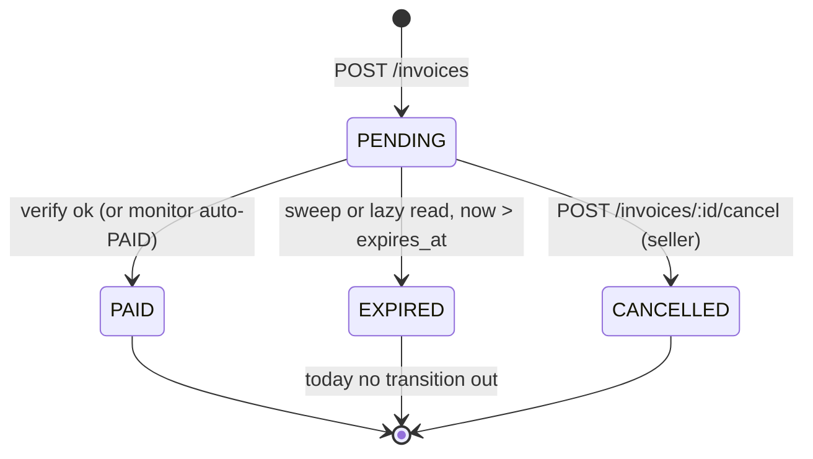

# Invoice expiry and late-payment policy

Status: proposal (issue #384). It describes the behaviour that exists today and
recommends the default for the freelancer MVP; the code changes it implies are
listed at the end.

## Where the rules live today

| Rule | Location | Value |
|---|---|---|
| Allowed expiry range | `backend/src/domain/invoice-expiry.ts` | integer, 1-30 days |
| Default expiry | same file, `DEFAULT_INVOICE_EXPIRY_DAYS` | 7 days |
| Lazy expiry on read | `backend/src/storage/memory-storage.ts` | a read marks `PENDING` + past `expiresAt` as `EXPIRED` |
| Sweep expiry | `backend/src/services/invoice.service.ts`, called from `payment-monitor.service.ts` | `UPDATE ... SET status = 'EXPIRED'` every 60s |
| State set | `backend/src/storage/invoice-storage.ts` | `PENDING` \| `PAID` \| `EXPIRED` \| `CANCELLED` |
| Payability guard | `backend/src/services/payment-verification.ts` | `PAID` -> `INVOICE_ALREADY_PAID`, `EXPIRED` -> `INVOICE_EXPIRED`, anything else -> `INVOICE_NOT_PENDING` |
| Creation guard | `backend/src/services/invoice.service.ts` (`WHERE ... status = 'PENDING' AND expires_at > NOW()`) | expiry is enforced at creation, not only later |

Two independent mechanisms set `EXPIRED`: the 60-second sweep, and the lazy
check on read. That matters below, because it means an invoice can be
`PENDING` in storage while its deadline has already passed.

## State machine

## Transition table

| From | To | Trigger | Guard today | Who writes it |
|---|---|---|---|---|
| - | `PENDING` | `POST /invoices` | `expiresInDays` is an integer in 1..30 | handler, both storage backends |
| `PENDING` | `PAID` | `POST /invoices/:id/verify` succeeds | every check in `payment-verification.ts` passes | handler |
| `PENDING` | `PAID` | monitor matches a streamed payment | same checks, called from the monitor | monitor |
| `PENDING` | `EXPIRED` | 60s sweep, or a read after the deadline | `status = 'PENDING' AND expires_at <= now` | `markExpiredInvoices` / lazy read |
| `PENDING` | `CANCELLED` | `POST /invoices/:id/cancel` | seller is the invoice owner | handler |
| `PAID` | - | terminal | | |
| `EXPIRED` | - | terminal today: verify returns `INVOICE_EXPIRED` | | |
| `CANCELLED` | - | terminal: verify returns `INVOICE_NOT_PENDING` | | |

## The late-payment edge case

Stellar payments are final. If a payer sends at 17:00 for an invoice that
expired at 16:59, the money is in the seller's account and no API can undo it.
Today the product's answer is `INVOICE_EXPIRED`: the invoice stays `EXPIRED`, the
payer sees a rejection, and the seller has funds attached to an invoice the tool
refuses to mark as settled. Because the sweep runs every 60 seconds, this can
happen to a payment that arrives *before* the payer's own screen stops offering
the pay button.

There is a second, sharper version of the same gap: a payment to a `CANCELLED`
invoice. The seller has explicitly withdrawn the request, so auto-marking it
`PAID` would be wrong, but silently ignoring the arrival is worse — the seller
needs to know money landed.

## Recommendation for the freelancer MVP

**Settle late payments, but never silently, and always label them.**

1. **Keep the money visible.** A detected payment for an expired invoice emits
   `payment.detected` and is attributed to the invoice; the funds are never
   ignored.
2. **Do not auto-transition.** `EXPIRED` and `CANCELLED` stop being absolute
   walls for the *seller's* own verify call, but they stay walls for anything
   automatic. The monitor may attribute; only an explicit seller action settles.
3. **Record lateness as derived data, not a new column.** `settled_late` is
   `paid_at > expires_at`, computed at verify and proof time. That keeps the
   in-memory MVP and Postgres in step with no migration.
4. **Give the payer a 24-hour grace window in the UI.** `grace_ends_at = expires_at
   + 24h`. Inside it the pay page stays reachable and says the invoice is past
   due; after it the pay page stops offering the button. The grace window is
   presentation only — it changes nothing about settlement, so a payment that
   arrives during grace is still a late payment and is labelled as one.

Rationale: a freelancer invoicing a client wants to be paid, and a manual refund
on Stellar costs more (in time and fees) than stating the truth on the proof.
Refusing to settle would push the seller into marking it PAID by hand, outside
the tool, which loses exactly the evidence the product exists to produce.

**Rejected alternatives.** Auto-accepting any late payment hides seller risk
(the invoice may already be paid twice, and a re-issued invoice is common).
Auto-refunding is not implementable without the seller's key and would make the
tool a custodian.

## Example proof wording

On-time settlement, unchanged:

> Settled on 13 September 2026, before the due date of 13 September 2026.

Late settlement, where `paid_at` is after `expires_at`:

> Paid on 14 September 2026 at 09:21 UTC. The invoice was issued with a due date
> of 13 September 2026, so this settlement was received after the stated term.
> The transaction is confirmed on Stellar; the stated due date is part of the
> original invoice and has not been altered.

Cancelled invoice that received funds:

> This invoice was cancelled by the issuer before payment. A transfer was
> nonetheless received on 14 September 2026 at 09:21 UTC and is recorded here
> without altering the invoice's cancelled state. Refund arrangements are
> between the parties.

The wording never says "paid on time" for a late settlement, and it never
rewrites `expires_at`. The proof shows both timestamps so the reader can reach
their own conclusion.

## Code changes this implies

1. `checkInvoiceIsPayable`: keep returning `INVOICE_ALREADY_PAID` for `PAID`;
   return a "settle with lateness" outcome for `EXPIRED` when the caller is the
   seller; keep rejecting `CANCELLED`.
2. Verify handler: when the invoice is `EXPIRED`, compare the transaction's
   close time against `expiresAt` and set `settled_late` rather than refusing.
3. Monitor: attribute the payment, emit `payment.detected`, and leave the status
   untouched until the seller verifies.
4. `frontend`: derive `grace_ends_at` for the pay page copy only.
5. `docs/EXPIRY-AND-LATE-PAYMENT.md` becomes the reference the proof text and the
   audit log point at.

## Test plan

- `PENDING` + payment one second before `expires_at` -> `PAID`, `settled_late: false`
- `EXPIRED` + payment one second after -> settles with `settled_late: true`
- `EXPIRED` + payment two days after -> same outcome, no special-casing by age
- `CANCELLED` + payment -> status unchanged, `payment.detected` recorded
- sweep and lazy expiry agree: a read at the deadline produces the same stored
  state as the 60s sweep
- regression: `POST /invoices` still rejects an `expiresInDays` outside 1..30
