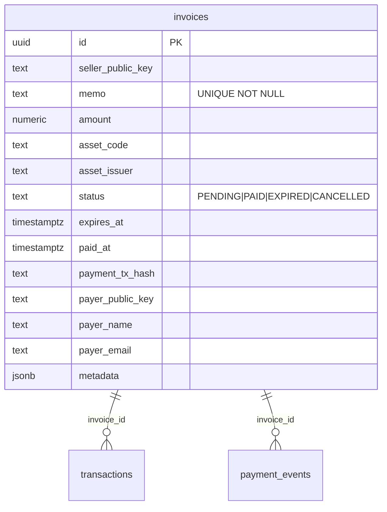

# MVP in-memory to Postgres cutover without breaking proof links

Status: proposal (issue #380). The checklist is written against the code as it is
today, including the parts that make the cutover unsafe if done in the wrong
order.

## What exists now

| Piece | Location | Note |
|---|---|---|
| In-memory server | `backend/src/server-mvp.ts` | the deployed MVP; a restart clears every invoice |
| Postgres server | `backend/src/server.ts` | full server, same route table via `routes/invoice.routes.ts` |
| Storage contract | `backend/src/storage/invoice-storage.ts` | both adapters implement `InvoiceStorage` |
| Adapters | `memory-invoice-storage.ts`, `postgres-invoice-storage.ts` | Postgres delegates to `InvoiceService` |
| Schema | `db/schema.sql` | applied by `backend/src/db/migrate.ts` |
| Connection | `backend/src/config/database.ts` | `DATABASE_URL`, `ssl` forced in production, `max: 20` |

The two adapters already agree on field names - `migrate.ts` states that the
schema carries the full parity column set so results map straight onto
`StoredInvoice` without renaming - which is why this is a cutover problem and
not a rewrites problem.

## Table draft

Two schema facts drive the risk section below:

1. **`memo` is `UNIQUE NOT NULL`.** The in-memory store has no such constraint.
2. **`id` is a UUID** in both places (memory uses `uuidv4()`, Postgres
   `DEFAULT gen_random_uuid()`), which is what keeps existing links valid.
   A drawn id that already exists is refused, never overwritten
   (`InvoiceIdCollisionError`, issue #512): memory checks before insert,
   Postgres retries once on the `invoices_pkey` unique violation.

## Why existing pay links survive - and the two ways they would not

A pay link is `/pay/<invoice id>` and the proof download resolves the same id,
so compatibility reduces to one question: does the id that existed before the
cutover still resolve after it?

- **Ids are UUIDs on both sides**, so an imported row keeps its id and every
  existing link and proof URL keeps working with no redirect layer.
- **Failure mode 1: memo collisions.** Importing a memory dump into a schema
  with `memo UNIQUE` fails the whole insert on the first duplicate. The
  import must detect collisions and either regenerate the memo (which breaks the
  "pay this exact memo" contract for an invoice someone may already have open)
  or park the row for manual resolution. Recommendation: abort the import and
  report the colliding ids, because silently rewriting a memo changes what a
  payer must send.
- **Failure mode 2: invoices that only ever existed in memory.** They are
  unrecoverable on restart today, so an invoice created seconds before the
  cutover and not yet exported simply does not exist afterwards. The cutover
  must be scheduled with a quiet window and the memory store dumped first, or it
  will lose live invoices that a client already has open.

## Cutover checklist

**Before**

1. Confirm the Postgres instance is reachable and `db/schema.sql` applies
   cleanly to an empty database (`npm run db:migrate`), because a partial schema is
   worse than no cutover.
2. Export the memory store (`GET /invoices` per seller, or a one-off dump) and
   store it with the deploy revision. This is the only copy.
3. Check the export for duplicate memos and for rows whose fields the schema
   rejects; resolve them before importing, not during.
4. Freeze invoice creation (announce a short window) so nothing is created after
   the dump.

**During**

5. Set the backend's environment to the Postgres mode: `DATABASE_URL` present,
   `NODE_ENV=production`, `FRONTEND_URL`/`FRONTEND_URLS` unchanged (readiness returns 503
   in production when no frontend origin is configured), and keep
   `ALLOW_SIMULATE=false` - production forces it false regardless, and a cutover is
   the wrong moment to discover the dev-only route is reachable.
6. Wait for `/api/ready` to return ready before moving traffic. It checks database
   connectivity and indexer freshness, so it is the gate that proves the new
   store is actually usable.
7. Import the dumped rows verbatim, preserving ids.
8. Spot-check three links end to end: a `PENDING` invoice pay page, a `PAID` proof
   download, and the dashboard history for the seller that has the most invoices.

**After**

9. Re-enable invoice creation and watch `/api/health` and `/api/ready` for the first
   hour.
10. Keep the memory instance's environment (not its state, which is gone) for a
    fast rollback of the *configuration*.

## Rollback, honestly stated

Rolling back the deployment to the in-memory server restores the code, not the
data: every invoice created after the cutover existed only in Postgres and is
invisible to the memory adapter, and the in-memory store starts empty. So:

- **Safe to roll back:** before any invoice is created post-cutover. Nothing has
  diverged yet.
- **Not safe after that:** rollback becomes a data-loss event unless the Postgres
  rows are exported first and re-imported into a rebuilt memory store, which
  means shipping an import path that does not exist today.
- The practical rule: treat the cutover as one-way once the first invoice is
  created, and make the empty-DB boot test (step 1) the thing that earns
  confidence beforehand.

## Empty-database boot

The MVP never has to boot without data; Postgres does. Cover:

- `npm run db:migrate` against a brand-new database, then `/api/ready` ready with
  zero invoices
- `GET /invoices` for a seller with no rows returns an empty list, not an error
- `GET /invoices/stats` with no rows returns zeroed aggregates
- a pay link for an id that does not exist renders the invoice-unavailable
  state rather than crashing
- `server-mvp.ts` still starts with no `DATABASE_URL` at all, so the demo can be
  rolled back by dropping one variable and redeploying

## Suggested sequencing

1. **#377 (shared invoice and verify contracts) first.** The cutover is a
   data-shape problem; doing it while the two sides still describe invoices
   differently means importing against a moving target.
2. **#379 (idempotent verify under concurrency, replay, memo collision) second.**
   Concurrency semantics only become real once there is a database enforcing
   them, and the memo-collision case above is exactly the shape #379 worries
   about - resolving that discussion first decides how the import handles
   duplicates.
3. **This cutover third**, then #375 (Horizon stream failover and a durable
   cursor) last, because a durable cursor is only meaningful once invoices
   outlive a process restart.
4. #378 (USDC trustline and amount edge cases) is independent of all of the
   above and can land at any point.

## Test plan

- import a fixture dump with a duplicate memo -> import aborts, the collision is
  named, and no partial rows are written
- import a clean dump -> ids are byte-identical to the source, every pay link and
  proof URL from the fixture resolves on the Postgres server
- empty-database boot -> ready, empty list, zeroed stats, unavailable-invoice
  state, and no crash
- readiness gate: traffic is not served before `/api/ready` returns ready
- rollback drill on staging: drop `DATABASE_URL`, redeploy, confirm the memory
  server starts and serves an empty store, and confirm the Postgres rows are
  still intact for a second attempt
